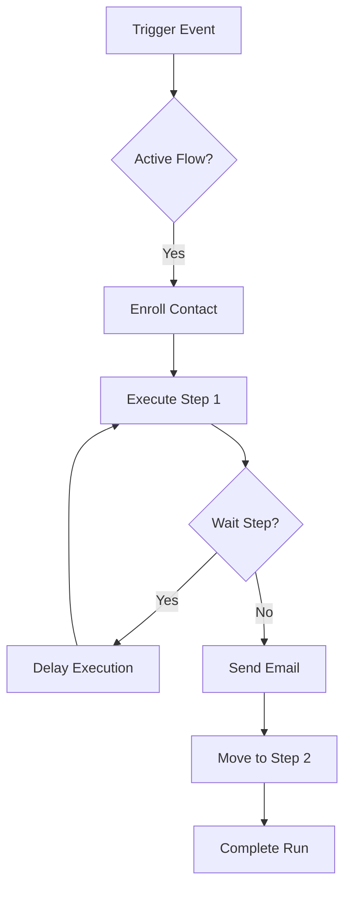

# Automations

Mailzor's Automation module allows you to create event-driven workflows that nurture your contacts automatically.

## Workflow Concept

Automations are linear sequences of steps triggered by specific contact actions.

### Trigger Types
- **Group Joined**: Fires when a contact is added to a specific group.
- **Email Opened**: Fires when a contact opens a specific campaign email.
- **Link Clicked**: Fires when a contact clicks a tracked link.

### Step Types
1. **Send Email**: Automatically dispatches a specific template to the contact.
2. **Wait**: Delays the next step for a configurable duration (minutes, hours, or days).

## Enrollment & Execution

### Enrollment
When a trigger event occurs (e.g., a contact is imported into a group), the system checks for active automation flows tied to that trigger and "enrolls" the contact.

### The Execution Engine
1. **Run Record**: A new `AutomationRun` record is created for the contact.
2. **Step Sequence**: The engine processes the steps in order.
3. **Queue-Based**: Every step is processed as a background job to ensure reliability.
4. **Idempotency**: Contacts are prevented from being enrolled in the same flow multiple times simultaneously.

## Technical Details

### Models
- `AutomationFlow`: The workflow definition.
- `AutomationStep`: Individual steps (email/wait) within the flow.
- `AutomationRun`: Tracking an individual contact's journey through the flow.

### Monitoring
Admins can monitor automation performance:
- **Enrollment Count**: Total contacts that have entered the flow.
- **Completion Rate**: Percentage of contacts that reached the final step.
- **Run Logs**: Detailed audit trail for every automation step executed.

## Developer Notes
- **Controller**: `App\Http\Controllers\AutomationController`
- **Service**: `App\Services\AutomationService`
- **Job**: `App\Jobs\ProcessAutomationStep`

::: info
Automation flows can be toggled between **Active** and **Draft**. Triggers will only fire for active flows.
:::

