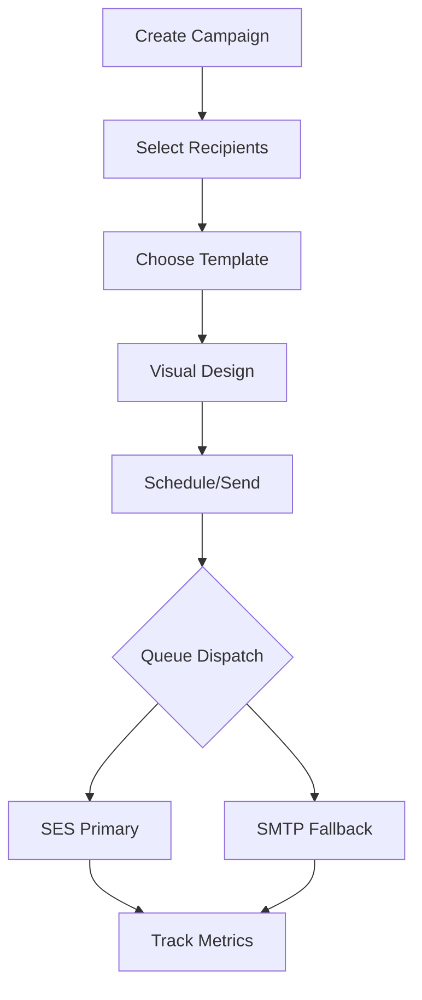

# Campaigns

The Campaign module is the heart of Mailzor, allowing users to build, schedule, and track bulk email sends.

## Feature Overview

Mailzor features a multi-step campaign builder that ensures all necessary configuration is completed before sending.

### Campaign Stages
1. **Details**: Subject line, from name, and from email (sender selection).
2. **Recipients**: Selection of contacts or specific contact groups.
3. **Template**: Choosing a pre-designed template from the gallery or starting from scratch.
4. **Design**: Customizing the chosen template using the visual drag-and-drop builder.
5. **Review & Send**: Final check of the campaign settings and scheduling.

## Technical Flow

### 1. Recipient Processing
When a campaign is dispatched, the system calculates the unique recipient list based on the selected groups.
- **Database Table**: `campaign_messages`
- **Logic**: Filters out bounced, unsubscribed, and duplicate contacts.

### 2. Batch Sending
To handle large lists, Mailzor splits the campaign into small batches.
- **Job**: `App\Jobs\SendCampaignBatch`
- **Concurrency**: Multiple batches run in parallel across the configured queue workers.
- **Hybrid Routing**: The system tries Amazon SES first; if it fails or hits a rate limit, it falls back to the configured SMTP server.

### 3. Tracking Integration
Every email sent is injected with a tracking pixel and rewritten links.
- **Open Tracking**: `GET /t/o/{token}`
- **Click Tracking**: `GET /t/c/{token}?url={target}`

## Analytics & Reports

Each campaign has a dedicated report page featuring:
- **Delivery Rate**: Percentage of emails successfully delivered.
- **Open Rate**: Unique vs. total opens.
- **Click Rate**: Performance of individual links.
- **Activity Timeline**: Hourly breakdown of engagement.

## Admin Actions

Admins can monitor all user campaigns from the Admin Panel:
- **Global List**: View all campaigns across the platform.
- **Send Status**: Monitor real-time progress of any sending campaign.
- **Restore**: Recover soft-deleted campaigns for users.

## Developer Notes
- **Models**: `App\Models\Campaign`, `App\Models\CampaignMessage`
- **Controller**: `App\Http\Controllers\CampaignController`
- **Route Resource**: `admin.campaigns`

