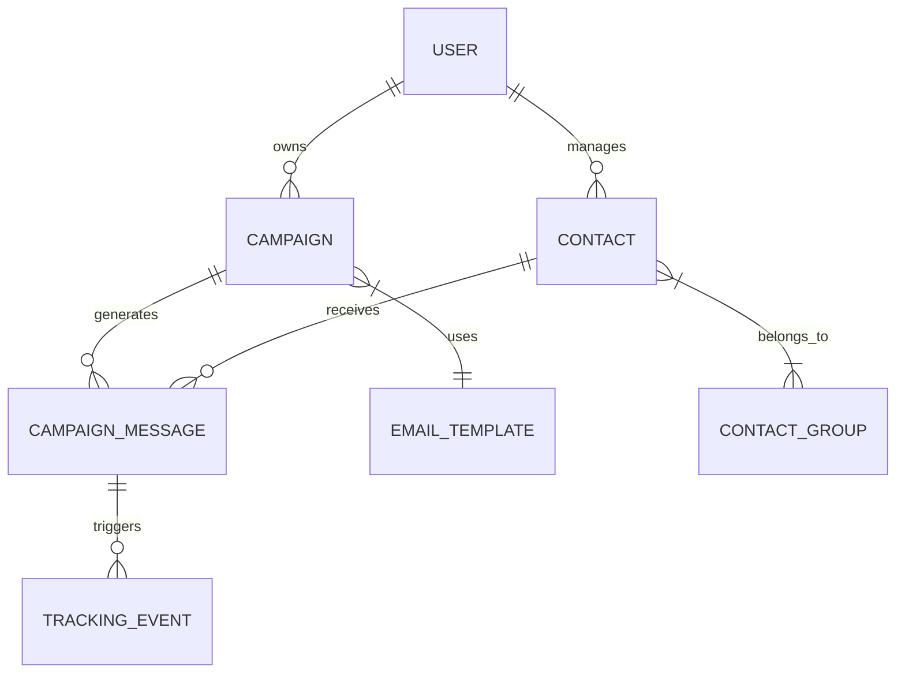

# Database Schema

Mailzor uses a structured relational database (MySQL) to manage high volumes of contacts, campaigns, and tracking events.

## Core Entity Relationship

## Primary Tables

### `users`
The main table for platform customers.
- `first_name`, `last_name`, `email`
- `is_active` (boolean)
- `credit_balance` (decimal)

### `campaigns`
Stores campaign configuration and aggregate metrics.
- `subject`, `from_name`, `from_email`
- `status` (draft, scheduled, sending, completed)
- `total_recipients`, `sent_count`, `open_count`, `click_count`

### `campaign_messages`
A high-volume table tracking every individual email sent.
- `campaign_id`, `contact_id`
- `token` (unique tracking token)
- `sent_at`, `opened_at`, `clicked_at`, `failed_at`

### `contacts`
The audience database.
- `email` (unique index)
- `first_name`, `last_name`, `gender`, `birthday`
- `status` (active, unsubscribed, bounced, complained)

### `email_templates`
JSON-based email designs.
- `name`, `content` (JSON), `is_published`
- `owner_type`, `owner_id` (Polymorphic: can be User or Admin)

## System Tables

### `email_validations`
Cache for validation results to prevent redundant checks.
- `email`, `status`, `score`, `mx_record`

### `tracking_events`
Audit trail for every open and click.
- `campaign_message_id`
- `type` (open, click)
- `ip_address`, `user_agent`, `url`

### `credit_histories`
Ledger for all credit transactions (purchases and usage).
- `user_id`, `amount`, `type`, `note`

## Indexing Strategy
To ensure performance at scale, we utilize several composite indexes:
- `contacts(email, owner_id)`: For rapid duplicate checking.
- `campaign_messages(token)`: For high-speed tracking resolution.
- `campaign_messages(campaign_id, status)`: For real-time progress reporting.

## Developer Notes
- **Migration Path**: `database/migrations`
- **Factrories**: `database/factories`
- **Seeders**: `database/seeders`
